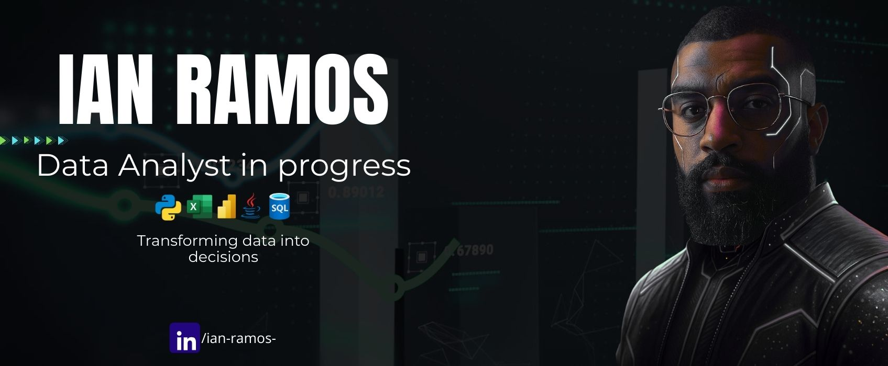

<!-- Título grande com imagem (como no exemplo) -->

  

<h3 align="center"> BI & Data Analytics • Inteligência Artificial • Análise e Desenvolvimento de Sistemas </h3>

---

### 🧰 Tech Stack

  

---

### 👋 Sobre mim
Formado em Análise e Desenvolvimento de Sistemas, sou motivado por transformar problemas reais em soluções com impacto.  
Atualmente, estou focado em Análise de Dados e negócios utilizando SQL, Power BI, Excel e Python, com estudos e prática constante.

Na minha função atual, sou Consultor de Tecnologia na EY focado em transformar dados operacionais em eficiência e impacto positivo para os negócios. Focado em identificar gargalos e automatizar processos para gerar ROI real. 
Participei de projetos relacionados a mapeamento de processos, prevenção a fraudes e atualmente em tecnologia focado na gestão e controle de vagas, sempre no contexto de bancos (de pequeno a grande porte) e seguradoras.

Além da prática do trabalho, sigo aprofundando meus conhecimentos em dados e aplicando-os em projetos com foco em resolver problemas reais de negócio.

🧠✨ E sim... gosto de usar Inteligência Artificial como parceira de trabalho sempre que posso — seja pra acelerar ideias, explorar insights ou criar visuais como esse banner cyberpunk aqui no perfil. 😎🤖

Recentemente, desenvolvi meu primeiro projeto completo com um dataset gerado por IA, mas 100% fiel aos dados e dinâmicas reais com base na minha experiência profissional. O resultado foi mostrar um dos trabalhos que fiz em um dos meus maiores cases (reduzir custos em R$ 200k/ano usando análise e controle de dados) permitindo visualização de sazonalidades, respostas rápidas a dúvidas recorrentes e identificação de oportunidades de campanhas de conscientização com base nos dados.

---

### 💼 Meus projetos

| Projeto | Descrição | Link |
|--------|-----------|------|
| **💧 Painel de Consumo de Água - Condomínio** | Projeto completo com geração de dataset sintético realista, análise de sazonalidade, dashboard interativo em Power BI oferecendo indicadores relevantes e insights de valor para a resolução de problemas de negócio. | [🔗 Acessar projeto](https://github.com/Ian-Ramoss/ianramos-data-portfolio/tree/main/Controle-agua-condominio) |

---

### 🧠 Habilidades

- **BI**: Power BI, DAX, Storytelling com Dados  - Em desenvolvimento
- **Análise**: SQL, Excel Avançado, Modelagem de dados  
- **Linguagens**: Estudando Python (automações/engenharia de dados) | Conhecimento em Java para desenvolvimento de software  
- **Soft Skills**: Liderança, pensamento estratégico, foco em impactos positivos no negócio, adaptabilidade e boa comunicação
- **Idiomas**: Inglês intermediário

---

### 📚 Aprendizado Atual

- 🔸 SQL para análise de dados, automações e insights em BI
- 🔸 Power BI: Avançando em DAX, relatórios profissionais e projetos de negócio
- 🔸 Aplicação prática dos conhecimentos em projetos com storytelling: visual, impacto e foco em soluções de negócio  

---

### 📫 Contato
- [LinkedIn](https://linkedin.com/in/ian-ramos-) 

---

