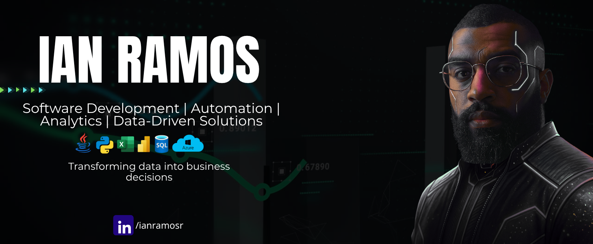
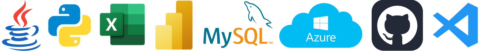

<!-- Título grande com imagem (como no exemplo) 

  

<h3 align="center"> SERVICENow | Financial Services </h3>

---

### 🧰 Tech Stack

  

---
-->
### 👋 Sobre mim
Consultor de Tecnologia na EY, atuando em projetos para o setor financeiro com foco em desenvolvimento de soluções utilizando ServiceNow.
Atualmente trabalho com desenvolvimento em App Engine, automação de processos e construção de aplicações corporativas utilizando JavaScript. Minha experiência anterior em Financial Services me proporcionou uma visão sólida de processos bancários, controles internos, prevenção à fraude e transformação digital.
Sou formado em Análise e Desenvolvimento de Sistemas e mantenho um perfil voltado ao aprendizado contínuo. Além de ServiceNow, já tive contato com SQL, Python, Power BI e desenvolvimento de soluções para automação e análise de dados. Utilizo IA como ferramenta para acelerar aprendizado, produtividade e prototipação de soluções.

---

## 🚧 Projetos ServiceNow
Estou atualmente direcionando meus estudos e projetos para o ecossistema ServiceNow.
Por estar construindo projetos pessoais específicos para a plataforma, os repositórios públicos serão publicados gradualmente.
Enquanto isso, abaixo estão alguns projetos desenvolvidos anteriormente em outras tecnologias que representam minha base técnica em desenvolvimento, automação e análise de dados.

### Outras Tecnologias
| Nome | Descrição | Link |
|--------|-----------|------|
| 🤖 **Bot de Escala de Trabalho — Telegram** | Desenvolvimento de um bot no Telegram utilizando Python para visualizar e gerenciar escalas de trabalho, solucionando um problema real de conciliação entre duas jornadas distintas (24h e 12h). Permite consultas por dia, semana, mês e ano, automatizando a rotina e melhorando a organização pessoal. | [🔗 Ver projeto](https://github.com/Ian-Ramoss/ianramos-tech-lab/tree/main/Projetos-pessoais/bot_escala_de_trabalho) 
| **🔍 Análise de Detecção de Fraudes — PaySim** | Análise exploratória de 6,3 milhões de transações mobile para identificar padrões de fraude, calcular prejuízo não detectado (R$ 11,98 Bi) e avaliar eficiência do modelo de detecção usando Matriz de Confusão. Pipeline completo no Databricks com arquitetura Bronze → Silver → Gold. | [🔗 Ver projeto](https://github.com/Ian-Ramoss/ianramos-data-portfolio/tree/main/Preven%C3%A7%C3%A3o%20a%20fraudes)
| **💧 Painel de Consumo de Água - Condomínio** | Projeto completo com geração de dataset sintético realista, análise de sazonalidade, dashboard interativo em Power BI oferecendo indicadores relevantes e insights de valor para a resolução de problemas de negócio. | [🔗 Acessar projeto](https://github.com/Ian-Ramoss/ianramos-data-portfolio/tree/main/Controle-agua-condominio) |
|Projetos de Cursos| Projetos realizados através de cursos em diversas plataformas e sobre algumas tecnologias (SQL, Python, Azure, etc)| [🔗 Projetos de Cursos](https://github.com/Ian-Ramoss/ianramos-data-portfolio/tree/main/Projetos_cursos)|

---

### 🧠 Habilidades
🔸ServiceNow
🔸JavaScript
🔸App Engine
🔸Business Process Automation
🔸Financial Services
🔸Inglês intermediário
🔸SQL
🔸DataBricks

---

### 📫 Contato
- [LinkedIn](https://linkedin.com/in/ianramosr) 

---

